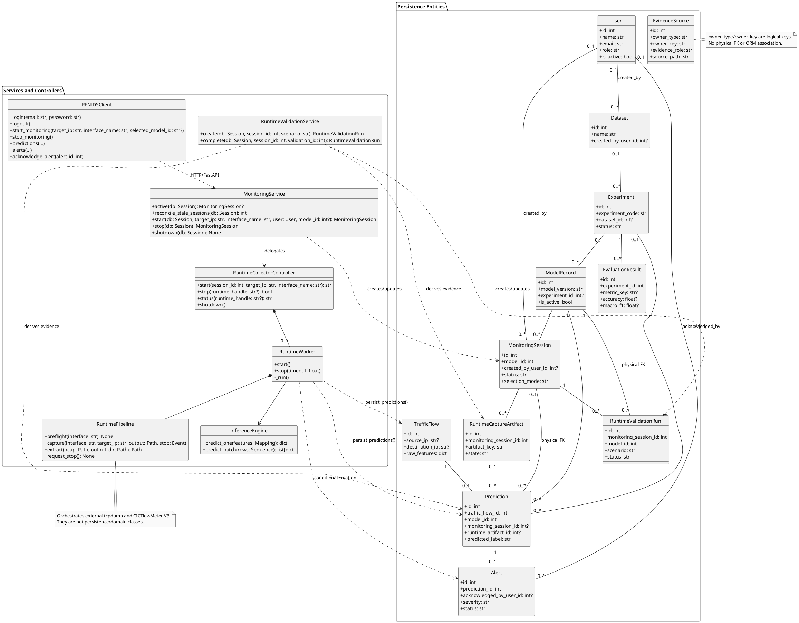

# RF-NIDS Chapter III Class Diagram Audit

## 1. Audit Scope

Audit ini membaca implementasi aktual tanpa menjalankan migration, training, inference, atau penulisan database. Satu-satunya file yang dibuat adalah laporan ini.

Sumber utama:

- Entity ORM: `src/api/models.py:34-443`.
- Lifecycle monitoring: `src/api/monitoring.py:30-213`.
- Runtime capture/controller: `src/api/runtime_monitoring.py:87-645`.
- Runtime validation: `src/api/runtime_validation.py:30-200`.
- Inference: `src/inference/predictor.py:24-169`.
- Feature adaptation: `src/ingestion/feature_adapter.py:52-194`.
- Persistence/alert generation: `src/api/service.py:11-130`.
- Authentication: `src/api/auth.py:27-163`, `src/api/main.py:337-378`.
- Dashboard client/UI: `dashboard/api_client.py:25-226`, `dashboard/pages/monitoring.py:62-181`.

Catatan penting: class entity yang mewakili tabel `models` bernama **`ModelRecord`**, bukan `Model`. Tidak ada class ORM bernama `Model`.

## 2. Entity / ORM Class Audit

Seluruh entity mewarisi `Base`. Semua baris `relationship()` adalah navigasi ORM; FK fisik dibedakan secara eksplisit. Tidak satu pun dari 12 class entity mendefinisikan business method atau CRUD method. Fungsi `utcnow()` berada di tingkat modul, bukan method entity (`src/api/models.py:30-31`).

### 2.1 `User`

- Table: `users` (`models.py:34-35`).
- Attributes: `id: int`, `name: str`, `email: str`, `password_hash: str`, `role: str`, `is_active: bool`, `created_at: datetime`, `updated_at: datetime` (`models.py:39-48`).
- PK: `id`.
- FK: tidak ada.
- ORM relationships:
  - `datasets: list[Dataset]` ↔ `Dataset.created_by_user`.
  - `acknowledged_alerts: list[Alert]` ↔ `Alert.acknowledged_by_user`.
  - `monitoring_sessions: list[MonitoringSession]` ↔ `MonitoringSession.created_by_user` (`models.py:49-55`).
- Cardinality: `User 1 — 0..* Dataset`; `User 1 — 0..* Alert` sebagai acknowledging user; `User 1 — 0..* MonitoringSession`. Pada sisi child, user opsional karena ketiga FK nullable.
- Methods defined on class: none.

### 2.2 `Dataset`

- Table: `datasets` (`models.py:58-59`).
- Attributes: `id: int`, `name: str`, `source_path: str?`, `source_sha256: str?`, `total_rows: int?`, `total_features: int?`, `label_column: str?`, `class_distribution: dict?`, `created_by_user_id: int?`, `created_at: datetime`, `updated_at: datetime` (`models.py:60-74`).
- PK: `id`.
- FK: `created_by_user_id → users.id`, nullable, `ON DELETE SET NULL` (`models.py:68-70`).
- ORM relationships: `created_by_user: User?`; `experiments: list[Experiment]` (`models.py:75-76`).
- Cardinality: setiap `Dataset` mempunyai `0..1 User`; `Dataset 1 — 0..* Experiment` dan setiap experiment mempunyai `0..1 Dataset`.
- Methods: none.

### 2.3 `Experiment`

- Table: `experiments` (`models.py:79-80`).
- Attributes: `id: int`, `experiment_code: str`, `experiment_name: str`, `experiment_type: str`, `dataset_id: int?`, `description: str?`, `status: str`, `source_path: str?`, `source_sha256: str?`, `schema_version: str?`, `imported_at: datetime?`, `created_at: datetime`, `updated_at: datetime` (`models.py:81-97`).
- PK: `id`.
- FK: `dataset_id → datasets.id`, nullable, `ON DELETE SET NULL` (`models.py:85-87`).
- ORM relationships: `dataset: Dataset?`, `evaluation_results: list[EvaluationResult]`, `models: list[ModelRecord]`, `predictions: list[Prediction]` (`models.py:98-103`). `evaluation_results` memakai `cascade="all, delete-orphan"`.
- Cardinality: `Experiment` mempunyai `0..1 Dataset`; `Experiment 1 — 0..* EvaluationResult/ModelRecord/Prediction`.
- Methods: none.

### 2.4 `EvaluationResult`

- Table: `evaluation_results` (`models.py:106-107`).
- Attributes: `id: int`, `experiment_id: int`, `class_name: str?`, `metric_key: str?`, `accuracy: float?`, `precision_score: float?`, `recall_score: float?`, `f1_score: float?`, `macro_precision: float?`, `macro_recall: float?`, `macro_f1: float?`, `false_positive_rate: float?`, `true_positive: int?`, `true_negative: int?`, `false_positive: int?`, `false_negative: int?`, `confusion_matrix: dict|list?`, `notes: str?`, `source_path: str?`, `source_sha256: str?`, `created_at: datetime` (`models.py:111-133`).
- PK: `id`.
- FK: `experiment_id → experiments.id`, non-null, `ON DELETE CASCADE` (`models.py:112-114`).
- ORM relationship: `experiment: Experiment` (`models.py:134`).
- Cardinality: setiap result tepat `1 Experiment`; `Experiment 1 — 0..* EvaluationResult`.
- Methods: none.

### 2.5 `EvidenceSource`

- Table: `evidence_sources` (`models.py:137-138`).
- Attributes: `id: int`, `owner_type: str`, `owner_key: str`, `evidence_role: str`, `source_path: str`, `source_sha256: str`, `schema_version: str?`, `imported_at: datetime` (`models.py:145-152`).
- PK: `id`.
- FK: none.
- ORM relationships: none.
- Cardinality: tidak ada physical/ORM association.
- Logical relationship only: `owner_type` dan `owner_key` dipakai sinkronisasi evidence untuk menunjuk owner secara polimorfik, tetapi bukan FK dan tidak boleh digambar sebagai association fisik (`src/application/evidence_sync.py:290-299`).
- Methods: none.

### 2.6 `ModelRecord` (bukan `Model`)

- Table: `models` (`models.py:155-156`).
- Attributes: `id: int`, `model_name: str`, `model_version: str`, `algorithm: str`, `accuracy: float?`, `macro_f1: float?`, `ddos_recall: float?`, `portscan_recall: float?`, `feature_count: int?`, `is_active: bool`, `experiment_id: int?`, `artifact_path: str?`, `artifact_sha256: str?`, `parameters: dict?`, `created_at: datetime` (`models.py:157-173`).
- PK: `id`.
- FK: `experiment_id → experiments.id`, nullable, `ON DELETE SET NULL` (`models.py:167-169`).
- ORM relationships: `predictions: list[Prediction]`, `experiment: Experiment?`, `monitoring_sessions: list[MonitoringSession]` (`models.py:174-181`). Prediction dan session collections memakai `passive_deletes=True`.
- Cardinality: `ModelRecord` mempunyai `0..1 Experiment`; `ModelRecord 1 — 0..* Prediction`; `ModelRecord 1 — 0..* MonitoringSession`.
- Physical FK tanpa ORM relationship: `ModelRecord 1 — 0..* RuntimeValidationRun` melalui `runtime_validation_runs.model_id`.
- Methods: none.

### 2.7 `MonitoringSession`

- Table: `monitoring_sessions` (`models.py:184-187`).
- Attributes: `id: int`, `target_ip: str`, `interface_name: str`, `model_id: int`, `selection_mode: str`, `selected_model_version: str?`, `selected_model_sha256: str?`, `status: str`, `started_at: datetime?`, `stopped_at: datetime?`, `created_by_user_id: int?`, `created_at: datetime`, `updated_at: datetime`, `last_error: str?`, `runtime_handle: str?`, `extractor_name: str?`, `extractor_version: str?`, `extractor_identity: str?`, `artifact_key: str?`, `artifact_root: str?`, `processing_state: str?`, `latest_processing_at: datetime?`, `flow_count: int`, `prediction_count: int`, `alert_count: int` (`models.py:205-235`).
- PK: `id`.
- FKs: `model_id → models.id`, non-null, `ON DELETE RESTRICT`; `created_by_user_id → users.id`, nullable, `ON DELETE SET NULL` (`models.py:208-219`).
- ORM relationships: `model: ModelRecord`, `created_by_user: User?`, `validation_runs: list[RuntimeValidationRun]`, `runtime_artifacts: list[RuntimeCaptureArtifact]` (`models.py:236-245`). Dua child collections memakai `cascade="all, delete-orphan"`.
- Cardinality: session tepat `1 ModelRecord`, `0..1 User`, dan mempunyai `0..*` validation/artifact.
- Physical FK tanpa ORM relationship: `MonitoringSession 1 — 0..* Prediction` melalui `predictions.monitoring_session_id`.
- Methods: none.

### 2.8 `TrafficFlow`

- Table: `traffic_flows` (`models.py:346-347`).
- Attributes: `id: int`, `capture_session_id: str?`, `capture_interface: str?`, `pcap_segment: str?`, `capture_time: datetime?`, `source_ip: str?`, `source_port: int?`, `destination_ip: str?`, `destination_port: int?`, `protocol: str?`, `raw_features: dict`, `created_at: datetime` (`models.py:348-359`).
- PK: `id`.
- FK: none. Tidak terdapat `monitoring_session_id`.
- ORM relationship: `prediction: Prediction?`, `cascade="all, delete-orphan"`, `passive_deletes=True`, `single_parent=True` (`models.py:360-366`).
- Cardinality: `TrafficFlow 1 — 0..1 Prediction`; setiap `Prediction` wajib mempunyai tepat `1 TrafficFlow`, dipaksa oleh FK non-null dan unique.
- Methods: none.

### 2.9 `Prediction`

- Table: `predictions` (`models.py:369-370`).
- Attributes: `id: int`, `traffic_flow_id: int`, `model_id: int`, `experiment_id: int?`, `monitoring_session_id: int?`, `runtime_artifact_id: int?`, `source_type: str?`, `external_key: str?`, `predicted_label: str`, `confidence_score: float`, `class_probabilities: dict`, `prediction_time: datetime`, `created_at: datetime` (`models.py:381-403`).
- PK: `id`.
- FKs: `traffic_flow_id → traffic_flows.id` CASCADE, non-null/unique; `model_id → models.id` RESTRICT, non-null; `experiment_id → experiments.id` SET NULL; `monitoring_session_id → monitoring_sessions.id` SET NULL; `runtime_artifact_id → runtime_capture_artifacts.id` SET NULL (`models.py:382-396`).
- ORM relationships: `traffic_flow: TrafficFlow`, `model: ModelRecord`, `experiment: Experiment?`, `runtime_artifact: RuntimeCaptureArtifact?`, `alert: Alert?` (`models.py:404-415`). `alert` memakai delete-orphan, passive deletes, single parent.
- Missing ORM navigation: tidak ada `monitoring_session` relationship walaupun physical FK ada.
- Cardinality: tepat `1 TrafficFlow`, tepat `1 ModelRecord`, `0..1 Experiment`, `0..1 MonitoringSession`, `0..1 RuntimeCaptureArtifact`, dan `0..1 Alert`.
- Methods: none.

### 2.10 `Alert`

- Table: `alerts` (`models.py:418-419`).
- Attributes: `id: int`, `prediction_id: int`, `severity: str`, `title: str`, `description: str`, `status: str`, `acknowledged_at: datetime?`, `acknowledged_by_user_id: int?`, `created_at: datetime` (`models.py:427-439`).
- PK: `id`.
- FKs: `prediction_id → predictions.id`, non-null/unique, CASCADE; `acknowledged_by_user_id → users.id`, nullable, SET NULL (`models.py:428-438`).
- ORM relationships: `prediction: Prediction`, `acknowledged_by_user: User?` (`models.py:440-443`).
- Cardinality: tepat `1 Prediction`; `0..1 User` dalam peran acknowledging user. `Prediction 1 — 0..1 Alert`.
- Methods: none.

### 2.11 `RuntimeCaptureArtifact`

- Table: `runtime_capture_artifacts` (`models.py:248-251`).
- Attributes: `id: int`, `monitoring_session_id: int`, `artifact_key: str`, `window_number: int`, `state: str`, `pcap_relative_path: str?`, `pcap_sha256: str?`, `pcap_size: int?`, `csv_relative_path: str?`, `csv_sha256: str?`, `csv_size: int?`, `extractor_identity: str?`, `extracted_row_count: int`, `adapted_row_count: int`, `error_stage: str?`, `error_message: str?`, `capture_started_at: datetime?`, `capture_finished_at: datetime?`, `extraction_finished_at: datetime?`, `committed_at: datetime?`, `created_at: datetime` (`models.py:263-285`).
- PK: `id`.
- FK: `monitoring_session_id → monitoring_sessions.id`, non-null, CASCADE (`models.py:264-266`).
- ORM relationships: `monitoring_session: MonitoringSession`, `predictions: list[Prediction]` (`models.py:286-289`).
- Cardinality: tepat `1 MonitoringSession`; `RuntimeCaptureArtifact 1 — 0..* Prediction`, sedangkan prediction mempunyai `0..1` artifact.
- Methods: none.

### 2.12 `RuntimeValidationRun`

- Table: `runtime_validation_runs` (`models.py:292-295`).
- Attributes: `id: int`, `monitoring_session_id: int`, `scenario: str`, `status: str`, `target_ip: str`, `interface_name: str`, `started_at: datetime`, `finished_at: datetime?`, `pcap_files_processed: int`, `pcap_bytes_processed: int`, `flows_extracted: int`, `flows_adapter_valid: int`, `predictions_committed: int`, `alerts_committed: int`, `normal_predictions: int`, `portscan_predictions: int`, `ddos_predictions: int`, `pipeline_result: str`, `detection_result: str`, `extractor_identity: str?`, `adapter_identity: str?`, `model_id: int`, `model_version: str`, `evidence_json: dict`, `notes: str?`, `created_at: datetime` (`models.py:315-342`).
- PK: `id`.
- FKs: `monitoring_session_id → monitoring_sessions.id`, non-null, CASCADE; `model_id → models.id`, non-null, RESTRICT (`models.py:316-338`).
- ORM relationship: hanya `monitoring_session: MonitoringSession` (`models.py:343`).
- Missing ORM navigation: tidak ada `model: ModelRecord` relationship walaupun physical FK `model_id` ada.
- Cardinality: tepat `1 MonitoringSession` dan tepat `1 ModelRecord` secara fisik.
- Methods: none.

## 3. Service / Controller Class Audit

Kelima class yang diminta semuanya ditemukan. Tiga collaborator pipeline yang benar-benar diperlukan untuk menjelaskan alur runtime juga dicatat, tetapi exception/data helper tidak dimasukkan ke rekomendasi diagram.

### 3.1 `MonitoringService`

- File: `src/api/monitoring.py:54-213`.
- Purpose: orkestrasi lifecycle persisten satu monitoring session dan delegasi ke collector.
- Important attributes: `collector: CollectorController` (`monitoring.py:55-56`).
- Actual methods:
  - `__init__(collector: CollectorController | None = None)`.
  - `active(db: Session) -> MonitoringSession | None` (static) (`:59-64`).
  - `reconcile_stale_sessions(db: Session) -> int` (`:66-84`).
  - `start(db: Session, *, target_ip: str, interface_name: str, user: User, model_id: int? = None, inference=None, selection_mode: str = "DEFAULT") -> MonitoringSession` (return type not annotated, verified from returned `row`; `:86-173`).
  - `shutdown(db: Session) -> None` (`:175-177`).
  - `stop(db: Session) -> MonitoringSession` (return type not annotated; `:179-213`).

### 3.2 `RuntimeCollectorController`

- File: `src/api/runtime_monitoring.py:554-645`.
- Purpose: registry dan lifecycle thread worker runtime per handle.
- Important attributes: `session_factory`, `inference`, `settings`, `worker_factory`, `_workers: dict`, `_lock`, `runtime_root`, class attribute `mode="RUNTIME_V3"` (`:554-567`).
- Actual methods:
  - `__init__(*, session_factory, inference, settings, worker_factory=RuntimeWorker)`.
  - `start(*, session_id: int, target_ip: str, interface_name: str, inference=None) -> str` (`:569-596`).
  - `stop(runtime_handle: str | None) -> bool` (`:598-613`).
  - `status(runtime_handle: str | None) -> str` (`:615-618`).
  - `shutdown()`; return annotation absent (`:620-627`).
  - `_on_exit(session_id, failure)` private callback (`:629-645`).

### 3.3 `RuntimeValidationService`

- File: `src/api/runtime_validation.py:30-200`.
- Purpose: membuat validation run dan menurunkan hasilnya dari evidence server yang persisten.
- Attributes: `artifact_root: Path`, `expected_feature_names: tuple` (`:31-33`).
- Methods:
  - `__init__(artifact_root: Path, expected_feature_names: list[str])`.
  - `create(db: Session, session_id: int, scenario: str) -> RuntimeValidationRun` (`:35-55`).
  - `complete(db: Session, session_id: int, validation_id: int) -> RuntimeValidationRun` (`:57-75`).
  - `_derive(db: Session, row: RuntimeValidationRun) -> None` private derivation (`:77-200`).

### 3.4 `InferenceEngine`

- File: `src/inference/predictor.py:24-169`.
- Purpose: memuat satu fitted model, memvalidasi metadata/hash/feature order, dan melakukan prediksi single/batch.
- Attributes: `metadata: dict`, `feature_names: list[str]`, `extra_feature_policy`, `model` (`predictor.py:35-74`).
- Public methods:
  - `__init__(model_path: Path, metadata_path: Path, *, extra_feature_policy: Literal["reject","ignore"]? = None, verify_model_hash: bool = True) -> None` (`:27-74`).
  - `predict_one(features: Mapping[str, Any]) -> dict[str, Any]` (`:139-155`).
  - `predict_batch(rows: Sequence[Mapping[str, Any]]) -> list[dict[str, Any]]` (`:157-169`).
- Private/static helpers: `_normalize_demo_metadata`, `_load_metadata`, `_prepare_row` (`:76-138`).

### 3.5 `RFNIDSClient`

- File: `dashboard/api_client.py:25-226`.
- Purpose: HTTP client dashboard untuk FastAPI RF-NIDS.
- Attributes: `base_url`, `timeout`, `session`, `access_token`, `token_provider` (`api_client.py:26-38`).
- Relevant public methods (return annotations generally absent):
  - Auth: `health()`, `login(email, password)`, `current_user()`, `logout()` (`:99-111`).
  - Presentation: `model_info()`, `active_model()`, `models()`, `datasets()`, `experiments()`, `experiment_evaluation(experiment_id)`, `evidence_sources(...)`, `summary()`, `timeline(minutes=60)` (`:113-141`).
  - Runtime reads: `predictions(...)`, `prediction(prediction_id)`, `traffic_flows(...)`, `monitoring_summary()`, `monitoring_status()`, `monitoring_interfaces()`, `monitoring_models()`, `monitoring_sessions(...)`, `monitoring_session_predictions(...)` (`:143-177`).
  - Runtime commands: `start_monitoring(target_ip, interface_name, selected_model_id=None)`, `stop_monitoring()`, `create_runtime_validation(session_id, scenario)`, `runtime_validations(session_id)`, `complete_runtime_validation(session_id, validation_id)` (`:179-197`).
  - Alerts/export: `alerts(...)`, `alert(alert_id)`, `acknowledge_alert(alert_id)`, `export_dataset()`, `export_experiment(...)`, `export_confusion_matrix(...)`, `export_predictions(...)`, `export_alerts(...)` (`:199-226`).
  - Private transport: `_access_token() -> str?`, `_request(...) -> Any`, `_download(...) -> Download` (`:40-97`).

### 3.6 Pipeline collaborators relevant to the diagram

#### `RuntimeWorker`

- File: `src/api/runtime_monitoring.py:311-551`.
- Purpose: background loop per session; capture, extraction, adaptation, batch inference, persistence, counter refresh.
- Attributes: `session_id`, `session_factory`, `inference`, `settings`, `on_exit`, `stop_event`, `failure`, `pipeline: RuntimePipeline`, `thread` (`:312-332`).
- Methods: `start()`, `stop(timeout: float)`, private `_set_processing_state`, `_fail_artifact`, `_run`, `_refresh_counts` (`:334-551`). Return annotations are absent.

#### `RuntimePipeline`

- File: `src/api/runtime_monitoring.py:87-308`.
- Purpose: preflight, tcpdump capture, safe artifact-path mapping, dan CICFlowMeter V3 Docker extraction untuk satu window.
- Important attributes: `root`, `host_root`, `image`, `expected_image_digest`, `source_commit`, `extractor_registry`, `window_seconds`, `extraction_timeout_seconds`, `resolved_image_identity`, `tcpdump_path` (`:90-117`).
- Methods: `preflight(interface: str) -> None`, `request_stop() -> None`, `force_stop() -> None`, `capture(interface, target_ip, output, stop)`, `host_artifact_path(path: Path) -> Path`, `extract(pcap: Path, output_dir: Path) -> Path`; private `_terminate_process` (`:118-308`).

#### `FeatureAdapter`

- File: `src/ingestion/feature_adapter.py:52-194`.
- Purpose: normalisasi, compatibility validation, ordering, dan numeric coercion fitur extractor menjadi input model.
- Attributes: `feature_names: list[str]`, `compatibility_policy: str` (`:55-64`).
- Methods: `from_metadata(...) -> FeatureAdapter` (class method), `compatibility(extractor_names: list[str]) -> dict[str, Any]`, `adapt(flow: ExtractedFlow) -> AdaptedFlow`; private `_normalized` dan static `_fingerprint` (`:66-194`).

## 4. Authentication Audit

Login/logout **bukan method pada `User`** dan tidak ada `AuthService` class.

| Concern | Actual implementation | Evidence |
|---|---|---|
| Login UI client | `RFNIDSClient.login(email, password)` mengirim POST | `dashboard/api_client.py:102-105` |
| Login API | nested FastAPI route function `login(payload, request, db)` dalam `create_app()` | `src/api/main.py:337-365` |
| Email normalization | module function `normalize_email(email) -> str` | `src/api/auth.py:27-28` |
| Password hashing | module function `hash_password(password) -> str` | `src/api/auth.py:31-52` |
| Password verification | module function `verify_password(password, encoded) -> bool` | `src/api/auth.py:55-75` |
| Session creation | module function `create_session(request, user_id) -> tuple[str, datetime]` | `src/api/auth.py:93-101` |
| Logout API | nested route function `logout(...)`, memanggil `revoke_session` | `src/api/main.py:367-372` |
| Token revocation | module function `revoke_session(request, token) -> None` | `src/api/auth.py:104-105` |
| Bearer authentication/current user | `get_current_user(...) -> User` | `src/api/auth.py:125-149` |
| Authorization admin | `require_admin(...) -> User` | `src/api/auth.py:152-159` |
| Current-user API | nested route function `current_user(user)` | `src/api/main.py:374-378` |
| Session representation | dataclass `SessionRecord(user_id, expires_at)`; in-memory `app.state.auth_sessions` | `src/api/auth.py:83-100`; `src/api/main.py:317` |

Implikasi class diagram: jangan menambahkan `login()`, `logout()`, `verifyPassword()`, atau session method pada `User`. Bila authentication perlu tampak, gambarkan `RFNIDSClient` bergantung pada FastAPI auth functions atau buat note “module functions”, bukan class fiktif.

## 5. Monitoring Flow Trace

1. **Administrator/UI:** `dashboard.pages.monitoring.render(client)` membaca status/model/interface dan memanggil `RFNIDSClient.start_monitoring()`/`stop_monitoring()` (`dashboard/pages/monitoring.py:62-121,161-181`).
2. **HTTP client/API:** `RFNIDSClient` mengirim request (`dashboard/api_client.py:158-197`); FastAPI route `start_monitoring`/`stop_monitoring` memvalidasi admin lalu memanggil service (`src/api/main.py:820-885`).
3. **Lifecycle service:** `MonitoringService.start()` membuat `MonitoringSession`, membekukan model version/hash, lalu mendelegasikan kepada collector (`src/api/monitoring.py:86-173`).
4. **Controller:** `RuntimeCollectorController.start()` membuat directory session, `RuntimeWorker`, dan thread (`runtime_monitoring.py:569-596`).
5. **Capture/extraction:** `RuntimeWorker._run()` memakai `RuntimePipeline.capture()` (tcpdump) dan `RuntimePipeline.extract()` (pinned CICFlowMeter V3 Docker) (`runtime_monitoring.py:371-464`; pipeline methods `:218-308`).
6. **Feature adaptation:** worker menggunakan `CICFlowMeterV3Adapter`; adapter runtime tersebut menghasilkan ordered features. General `FeatureAdapter` juga merupakan class adaptasi aktual (`runtime_monitoring.py:443-464`; `feature_adapter.py:52-194`).
7. **Inference:** worker memanggil `InferenceEngine.predict_batch()` (`runtime_monitoring.py:489`; `predictor.py:157-169`).
8. **Persistence/alerts:** worker memanggil module function `persist_predictions(...)`; fungsi membuat `TrafficFlow`, `Prediction`, dan untuk label DDoS/PortScan membuat `Alert` berdasarkan `SEVERITY` (`runtime_monitoring.py:505-518`; `src/api/service.py:11,76-130`).
9. **Runtime validation:** UI/API memanggil `RuntimeValidationService.create/complete`, yang membaca session, artifact, prediction, flow, dan alert untuk membangun `RuntimeValidationRun` (`runtime_validation.py:35-200`).

Tidak ada class bernama tcpdump atau CICFlowMeter. Keduanya external executables yang diorkestrasi `RuntimePipeline`, sehingga sebaiknya menjadi note/component, bukan class domain.

## 6. Verified Relationships

| Class A | Cardinality | Class B | Kind | Evidence |
|---|---|---|---|---|
| `User` | 1 → 0..* | `Dataset` | Physical FK + ORM | `models.py:49,68-75` |
| `User` | 1 → 0..* | `MonitoringSession` | Physical FK + ORM | `models.py:53-55,217-239` |
| `User` | 1 → 0..* | `Alert` (acknowledgement) | Physical FK + ORM | `models.py:50-52,436-443` |
| `Dataset` | 1 → 0..* | `Experiment` | Physical FK + ORM | `models.py:75-76,85-98` |
| `Experiment` | 1 → 0..* | `EvaluationResult` | Physical FK + ORM | `models.py:99-101,112-134` |
| `Experiment` | 1 → 0..* | `ModelRecord` | Physical FK + ORM | `models.py:102,167-178` |
| `Experiment` | 1 → 0..* | `Prediction` | Physical FK + ORM | `models.py:103,388-406` |
| `ModelRecord` | 1 → 0..* | `Prediction` | Physical FK + ORM | `models.py:174-177,385-405` |
| `ModelRecord` | 1 → 0..* | `MonitoringSession` | Physical FK + ORM | `models.py:179-181,208-236` |
| `ModelRecord` | 1 → 0..* | `RuntimeValidationRun` | Physical FK only | `models.py:338`; no matching relationship |
| `MonitoringSession` | 1 → 0..* | `RuntimeCaptureArtifact` | Physical FK + ORM | `models.py:243-245,264-288` |
| `MonitoringSession` | 1 → 0..* | `RuntimeValidationRun` | Physical FK + ORM | `models.py:240-242,316-343` |
| `MonitoringSession` | 1 → 0..* | `Prediction` | Physical FK only | `models.py:391-393`; no matching relationship |
| `RuntimeCaptureArtifact` | 1 → 0..* | `Prediction` | Physical FK + ORM | `models.py:289,394-409` |
| `TrafficFlow` | 1 → 0..1 | `Prediction` | Physical unique FK + ORM | `models.py:360-366,382-404` |
| `Prediction` | 1 → 0..1 | `Alert` | Physical unique FK + ORM | `models.py:410-415,428-440` |

`EvidenceSource` sengaja tidak memiliki association pada daftar ini. Relasi service/controller berikut adalah dependency/application relationships, bukan FK:

- `RFNIDSClient ..> FastAPI routes` melalui HTTP.
- `MonitoringService --> RuntimeCollectorController` melalui collector interface.
- `RuntimeCollectorController *-- RuntimeWorker` sebagai worker registry.
- `RuntimeWorker *-- RuntimePipeline` dan `RuntimeWorker --> InferenceEngine`.
- `RuntimeWorker ..> persist_predictions()`.
- `RuntimeValidationService ..> MonitoringSession/RuntimeCaptureArtifact/Prediction/Alert` melalui query aplikasi.

## 7. Recommended Thesis Class Diagram

### A. Entity / Persistence Classes

Gunakan seluruh 12 class aktual: `User`, `Dataset`, `Experiment`, `EvaluationResult`, `EvidenceSource`, `ModelRecord`, `MonitoringSession`, `TrafficFlow`, `Prediction`, `Alert`, `RuntimeCaptureArtifact`, `RuntimeValidationRun`. Gunakan attributes di Bagian 2. Jangan tampilkan method pada entity karena memang tidak ada.

Untuk keterbacaan, pisahkan visual menjadi package historical/presentation (`Dataset`, `Experiment`, `EvaluationResult`, `EvidenceSource`), shared (`User`, `ModelRecord`), dan runtime (`MonitoringSession`, `RuntimeCaptureArtifact`, `RuntimeValidationRun`, `TrafficFlow`, `Prediction`, `Alert`).

### B. Service / Controller Classes

Diagram utama disarankan memuat:

- `RFNIDSClient`: tampilkan `login`, `logout`, `start_monitoring`, `stop_monitoring`, `predictions`, `alerts`, `acknowledge_alert`, dan runtime-validation calls; method lain dapat disembunyikan agar tidak padat.
- `MonitoringService`: `active`, `reconcile_stale_sessions`, `start`, `stop`, `shutdown`.
- `RuntimeCollectorController`: `start`, `stop`, `status`, `shutdown`.
- `RuntimeWorker`: `start`, `stop`; `_run` dapat ditandai private.
- `RuntimePipeline`: `preflight`, `capture`, `extract`, `request_stop`.
- `InferenceEngine`: `predict_one`, `predict_batch`.
- `RuntimeValidationService`: `create`, `complete`.
- `FeatureAdapter`: `from_metadata`, `compatibility`, `adapt` hanya bila ingin menunjukkan adaptasi generik. Untuk path runtime konkret, beri note bahwa worker memakai `CICFlowMeterV3Adapter`.

`SessionRecord`, `APIError`, `Download`, exception classes, dan registry verification classes tidak diperlukan pada class diagram skripsi utama.

## 8. PlantUML Draft

Draft berikut hitam-putih, memisahkan persistence dan service/controller, dan menampilkan attributes inti/FK agar tetap terbaca. Daftar attribute lengkap tetap berada di Bagian 2.

PlantUML memakai association labels berdasarkan FK nullability: multiplicity di dekat parent `0..1` berarti child boleh tidak mempunyai parent tersebut; multiplicity child tetap `0..*`.

## 9. Final Verification

- **Total ORM classes:** 12.
- **ORM classes found:** `User`, `Dataset`, `Experiment`, `EvaluationResult`, `EvidenceSource`, `ModelRecord`, `MonitoringSession`, `RuntimeCaptureArtifact`, `RuntimeValidationRun`, `TrafficFlow`, `Prediction`, `Alert`.
- **Requested service/controller classes found:** 5/5 — `MonitoringService`, `RuntimeCollectorController`, `RuntimeValidationService`, `InferenceEngine`, `RFNIDSClient`.
- **Additional relevant pipeline classes found:** 3 — `RuntimeWorker`, `RuntimePipeline`, `FeatureAdapter`. Total relevant service/controller/pipeline classes audited: 8.
- **Class not found:** ORM class `Model`; implementation menggunakan `ModelRecord`. Tidak ada `AuthService`, class `tcpdump`, atau class `CICFlowMeter`.
- **Verified physical relationships:** 16 FK relationships. Empat belas mempunyai ORM navigation; dua hanya physical FK: `ModelRecord → RuntimeValidationRun` dan `MonitoringSession → Prediction`.
- **Logical-only relationship:** `EvidenceSource.owner_type/owner_key` ke owner evidence; bukan FK dan tidak digambar sebagai association fisik.
- **Methods on ORM entities:** 0 business/CRUD methods pada seluruh 12 entity.
- **Authentication form:** route functions + module functions + methods pada `RFNIDSClient`; bukan method `User`.
- **ORM/schema mismatches affecting diagram:** live PostgreSQL yang diaudit sebelumnya berada pada revision `20260905_08`, sehingga tiga attributes ORM/head (`MonitoringSession.selection_mode`, `selected_model_version`, `selected_model_sha256`) belum ada di live DB. `RuntimeValidationRun.model_id` dan `Prediction.monitoring_session_id` adalah FK tanpa ORM relationship navigation. Perbedaan JSON/JSONB dan ON DELETE live tidak mengubah class association count, tetapi harus tetap dicatat pada spesifikasi database.
- **NOT VERIFIED:** return types untuk method yang tidak diberi annotation dan external process behavior saat runtime; laporan tidak mengeksekusi capture, CICFlowMeter, inference, atau persistence.
- **Confidence:** **HIGH** untuk class, attributes, method signatures, ORM relationships, physical FK definitions, authentication structure, dan static monitoring flow; runtime execution tidak diuji karena audit wajib read-only.
